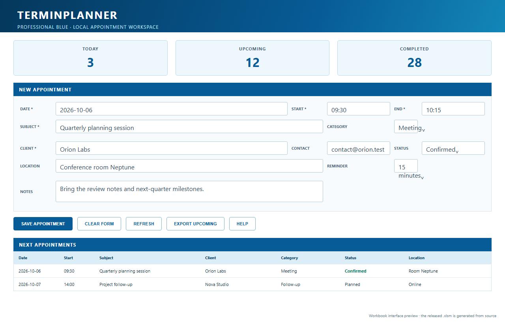

<p align="center">
  
</p>

# TerminPlanner

[](https://github.com/sofoste93/VBA_TerminPlanner/actions/workflows/ci.yml)
[](https://github.com/sofoste93/VBA_TerminPlanner/releases/latest)
[](src/VBA)
[](LICENSE)

TerminPlanner turns the original concept-only repository into a professional,
local-first appointment workspace for desktop Excel. The released `.xlsm` is
generated from the readable VBA source by a public workflow.



> This is a faithful documentation preview of the generated Dashboard. Excel is
> not installed in the build environment, so it is clearly presented as a
> preview rather than an Excel screenshot.

## Download and open

Download `TerminPlanner.xlsm` from the
[latest release](https://github.com/sofoste93/VBA_TerminPlanner/releases/latest).
It requires Microsoft Excel desktop with VBA support on Windows or macOS. Excel
for the web and mobile spreadsheet viewers cannot run the macros.

Downloaded Office files may have macros blocked. Inspect the public code and
checksums first. On Windows, right-click the file, choose **Properties**, select
**Unblock**, apply, then open it in Excel. Enable macros only for a copy you
trust. See [Security and macro trust](SECURITY.md).

## What it can do

- add appointments through a calm blue-and-white Dashboard;
- validate dates, times, required fields and controlled lists;
- keep a sortable and filterable appointment register;
- search across appointment details and clear the result safely;
- delete only the explicitly selected row after confirmation;
- show KPI totals and the next ten active appointments;
- export upcoming appointments to a local CSV file;
- explain usage and privacy in the integrated Guide sheet;
- keep all data inside the workbook unless the user requests an export.

TerminPlanner is a single-user local workbook. Its contents and CSV exports are
not encrypted, and it does not resolve simultaneous edits by several people.

## Build from source

Requirements: .NET 9 SDK. Excel is not required to build the workbook.

```powershell
powershell -ExecutionPolicy Bypass -File .\scripts\build.ps1
```

The builder creates `artifacts/TerminPlanner.xlsm`, reopens it and checks the
four required sheets, the VBA project and the embedded `modTerminPlanner`
module. EPPlus is a build-only dependency; read
[the third-party notice](THIRD_PARTY_NOTICES.md) before rebuilding commercially.

## Learning map

- [`modTerminPlanner.bas`](src/VBA/modTerminPlanner.bas) contains the business
  workflow, validation, filtering and CSV export.
- [`ThisWorkbook.cls`](src/VBA/ThisWorkbook.cls) keeps the startup event small.
- [`Program.cs`](tools/WorkbookBuilder/Program.cs) creates workbook structure,
  styles, controls, validation and embeds the VBA project.
- [`build.ps1`](scripts/build.ps1) provides a repeatable one-command build.

Start with the bilingual [Quick Start](docs/QUICKSTART.md). Comments explain
boundaries and decisions while leaving ordinary VBA statements readable.

Licensed under the [MIT License](LICENSE).
